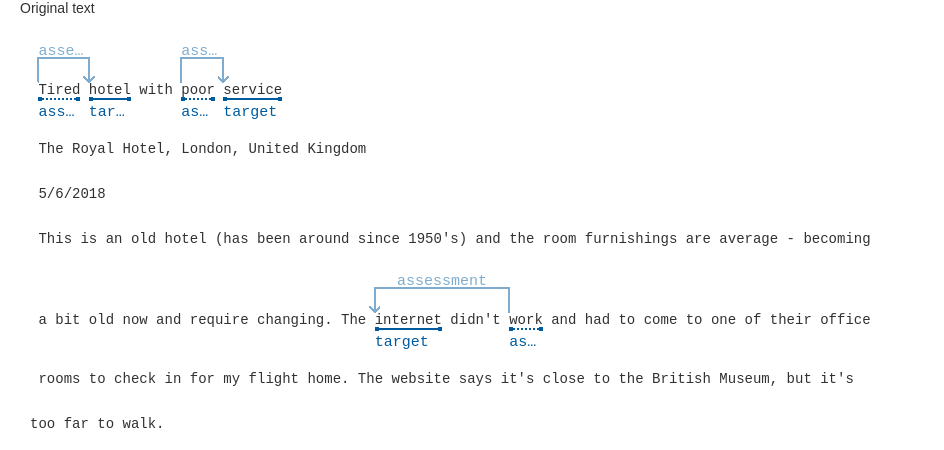

# Analyze-reviews-in-Language-Studio

- Analyze reviews in Language Studio

## Analise de sentimentos e opiniões usando o Language Studio Azure:

- Usei como base o texto da [documentação](https://microsoftlearning.github.io/mslearn-ai-fundamentals/Instructions/Labs/06-text-analysis.html).

## Este artigo tem como objetivo mostrar:

- O uso da IA para fazer uma analise de sentimentos e opiniões atraves de um texto.
- Expor o resultado em porcentagens de POSITIVO, NEUTRO ou NEGATIVO.

## Texto usado:

- O texto usado se encontra dentro do diretório /inputs/arquivos.txt.
- O algoritmo resultante dentro do diretório /inputs/arquivo.json.
- Um print de alguns pontos de algumas frases usadas como analise no diretório /inputs/sentimentos.png.

## Resultados obtidos:

```shell
Analyzed sentiment
Document sentiment
Negative
Confidence: 0.00%
0.00%
POSITIVE
3.00%
NEUTRAL
96.00%
NEGATIVE
```



---


